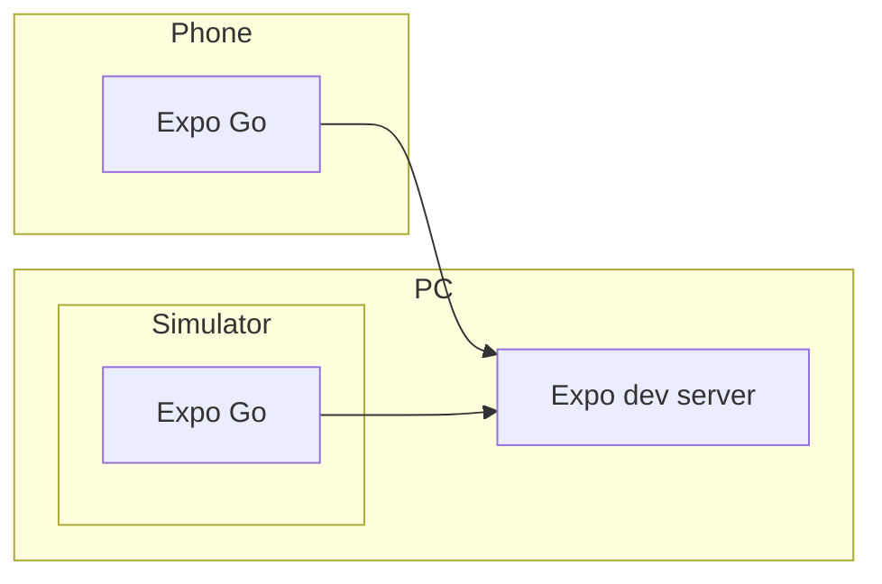

Expo で作ったアプリを App Store に公開しました。 (現在は iOS のみ)

https://apps.apple.com/jp/app/ai-prompt-editor/id6448696132

モバイルで OpenAI API の GPT を使うためのアプリです。テンプレートを穴埋め形式で入力することで、モバイルでも長文のプロンプトを作成しやすくします。

システム構成は以下のようになっています。

<iframe frameborder="0" style="width:100%;height:600px;" src="https://viewer.diagrams.net/?nav=1&title=expo-app.drawio#Uhttps%3A%2F%2Fdrive.google.com%2Fuc%3Fid%3D1dH8J7FQQLBlIJXbNckm2AGNXzH99Mov5%26export%3Ddownload"></iframe>

フロントエンドは TypeScript で書かれていて、 Expo を使った React Native アプリになっています。

バックエンドは Go 言語で、 AWS Lambda で動いています。 OpenAI API は Server Sent Events に対応しているので、それをアプリに WebSocket で送ります。

[Vercel](https://vercel.com/) はテンプレート文言を JSON ファイルとしてホストするために使用しています。

デプロイは、アプリについては手動 (ローカルマシンから EAS Build をトリガー) で、バックエンドについては GitHub Actions で CDK を実行しています。

リポジトリ:

- https://github.com/rokiyama/gpt-prompter-frontend
- https://github.com/rokiyama/gpt-prompter-backend
- https://github.com/rokiyama/gpt-chat-misc

## Expo での開発について

アプリで使用しているライブラリのうち主なものは以下の通りです。

- [Expo](https://expo.dev/) / [React Native](https://reactnative.dev/)
- [Redux Toolkit](https://redux-toolkit.js.org/)
- [Tailwind CSS](https://tailwindcss.com/) / [tailwind-rn](https://github.com/vadimdemedes/tailwind-rn)
- [Gifted Chat](https://github.com/FaridSafi/react-native-gifted-chat)

Expo を使うことで、ビルド環境をローカルに用意することなく開発からストア公開まで行うことができました。

Expo はライブラリや CLI ツールをはじめとした統合的なエコシステムになっていて、プロジェクトの生成を行う `create-expo-app` のほか、以下のようなアプリ・サービスを提供しています。

### Expo Go

開発中のプレビューは Expo Go というモバイルアプリを使用します。このアプリは開発用のクライアントで、 `npm run start` で起動したローカルのサーバに接続してアプリを動かせます。

このアプリはよくできていて、普通の React アプリを Web ブラウザでプレビューしながら開発するのとそんなに変わらない体験です。 Expo Go を使っている限りは、 JS のライブラリ関連でエラーに悩まされることはありますが、ネイティブ関連のビルドエラーとは無縁です。

シミュレータだけでなく実機でも動作し、 Expo ユーザとしてログインしていれば LAN 内の自分のサーバを自動で見つけてくれるなど、非常に便利です。

ただし Expo Go でできることは用意された Expo SDK の範囲でできることに限られ、それを逸脱する実装をしたい場合はカスタムのネイティブコードを含めてビルドする必要があります。このような場合の対応方法も用意されており、 [Development builds](https://docs.expo.dev/develop/development-builds/introduction/) という自分専用にカスタムされた Expo Go アプリのようなものをビルドする方法があります。

今回のアプリではカスタムビルドが必要になることはなかったのですが、一度試したところ後述の EAS Build を使えば特に難しいところもなくカスタムビルドを行うことができました。

### Expo Application Services (EAS)

Expo 社が提供するクラウドサービスです。このサービスにネイティブアプリのビルドと、 App Store 申請に必要な証明書の管理などを任せることができ、ストア公開まで比較的簡単にできました。

https://expo.dev/eas

一部、 Apple のサイトで手動による設定が必要なところもありますが、ドキュメントに従っていれば特に大きなトラブルもなく進められました。

無料で使い始めることができ、無料枠だとビルド回数が制限される、キューの待ちが発生する、インスタンスの性能も低いなどの制限があるようです。今回の開発では無料枠のまま使えていますが、頻繁にアップデートしたいなどの場合は有料プランが必要になりそうです。

https://expo.dev/pricing

ちょっと困ったのは、アプリバージョンとビルド番号の管理です。既に提出済みのビルド番号を再提出しようとするとエラーになるので、番号をインクリメントしてからビルドをトリガーする必要があるのですが、エラーになるのはビルドが完了した後の Apple に提出するタイミングです。なので、インクリメントを忘れるともう一度ビルドからやり直す必要が生じます。運用でカバーする方法を考えたいところです。

## 参考にしたもの

Udemy の講座が参考になりました。

- https://www.udemy.com/course/react-native-expo-firebase/
- https://www.udemy.com/course/react-native-first-step/
